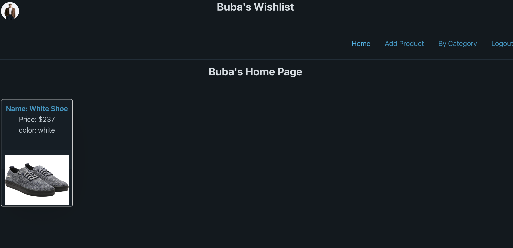

# My Phase-5 Project - My Wishlist

## Intro:
My application offers users the ultimate browsing experience by allowing them to explore the web and effortlessly save their most coveted products in one convenient place. Say goodbye to endless tabs and scattered wishlists; with our project, you can curate your dream list with ease. Whether you're hunting for fashion finds, tech gadgets, or home decor treasures, my app streamlines the process, ensuring you never lose track of those must-have items again. Happy browsing, and start building your dream wishlist today!

## How it works:
Instantly, you will be brought to the Login page, where you can either login if you already have an account, or you can click the Signup button, which will bring you to the Signup page where you can create a new account.

Once logged in you will be brought to the home page where you will be able to create your own profile and  wishlist.

Click on the profile icon and you will be brought to a form which will allow you to create your own profile. You'll have access to your devices files to upload your profile photo.

Once your profile is all set up you'll be able to to add a product to your wishlist by simply clicking on "Add Product" which will bring you to the add product form.

Once a product is submitted you'll see it being displayed on your home page. Click on an individual product, you'll be brought to that individual products page where you'll be able to delete, and edit that product. You can also click on that single product to be brought to that products URL where you can go ahead and purchase it.

Users can also browse products by category by clicking on the "By Category" button. 

